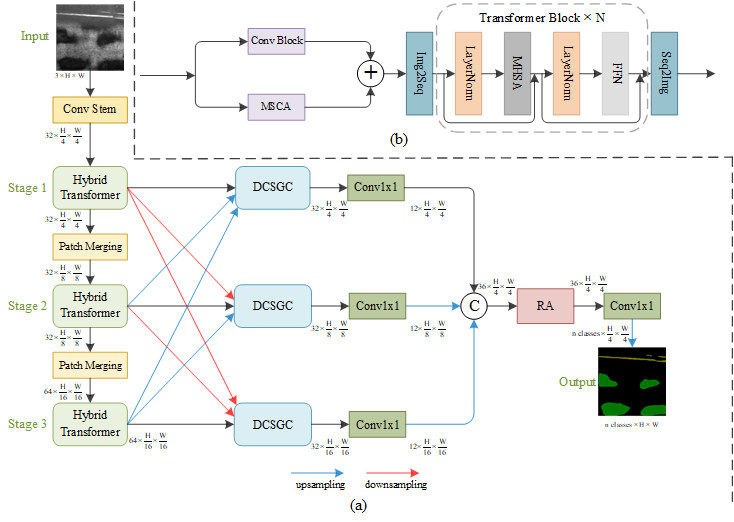

# HDRNet: Efficient Surface Defect Segmentation Network Based on CNN and Transformer
- author: Yubo Zheng / Rongdi Wang
- email: 1287293308@qq.com / wangyi@s.upc.edu.cn

## 1. Network arch

## 2. Usage
'main.py': Execute the main program, all model training and testing starts from this file, which contains the hyperparameter settings internally, and training is started by calling this program and passing the parameters.
'data/dataloaders.py': Data stream processing with support for multiple dataset loading and also customizable settings. Indexing of datasets by 'benchmark' keyword.
'model_trains/': Contains a variety of model training methods, and internally writes a 'basenetwork.py' file, which serves as a parent class that defines the initialization, validation, and testing behaviors of model training, so when a new training method needs to be defined, you just need to inherit it and refactor the training behaviors. 
'models/': The definition of the model structure, which currently supports a variety of fully supervised segmentation models, is invoked via 'get_model()' under 'net_factory'.
'utilities/': Training test toolkit, including evaluation metrics 'metric.py', gradient-like activation graphs 'gradcam.py', logging of training process 'logger.py', multiple loss functions 'losses.py', computational complexity measurement tool 'to_onnx.py', and so on.
## 3. Supported datasets
Currently supported datasets are 'NEU-SEG', 'KolektorSDD series', 'DAGM', 'RSDD series', 'CrackForest' and others. We will follow up with datasets.

## 3. Supported models
'U-Net', 'Seg-Net', 'PGA-Net', 'DeepLabV3', 'BiseNet', 'EDR-Net', 'SegFormer', 'Swin-UNet', 'TopFormer', 'HDRNet'.

## 4. Environmental needs
''Python >= 3.6 PyTorch >= 1.1.0 Albumentations tqdm tensorboardX cv2 numpy''
## 5. Run
For example, I need to run the HDRNet model on the NEU-SEG dataset, which can be entered in the terminal Terminal:
'python main.py --model hdrnet --benchmark neuseg --base_lr 0.001 --epochs 100 --log_path logs --dataset_root_path C:/../.. --mode totat-sup --batch_size 4'
Alternatively, we can change the parameters in main.py to train multiple models in succession.
We need to pass in a number of parameters at the same time in the 'main.py' program, '--model' for the trained model, '--benchmark' for the dataset, and '--dataset_root_path' for the path where the dataset will be stored after it is downloaded.

Program Run Logic：'main.py' --> 'data/dataloader.py'Dataset loading, instantiation --> 'model_trains/'Model training approach instantiation --> 'models/'Model Instantiation --> 
'model_trains/'Complete the training validation testing process --> 'utilities/'Training logs, metrics assessment, test picture result saving --> 'main.py'close.
## A thank-you note

Thanks to the project participants, Haiqiang Zuo, Rongdi Wang, Qizhou Huang, etc.

